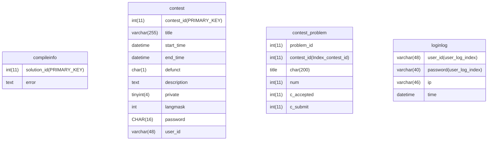
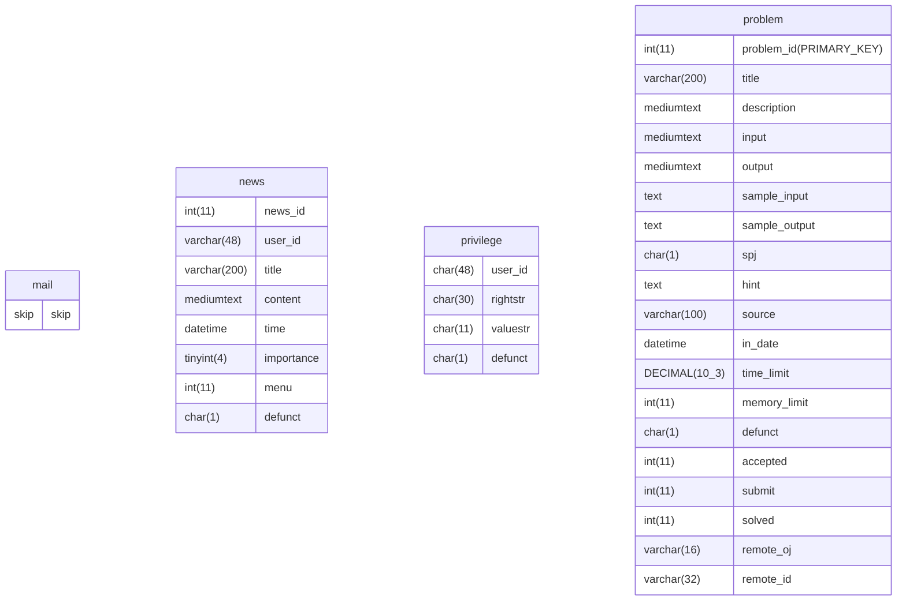
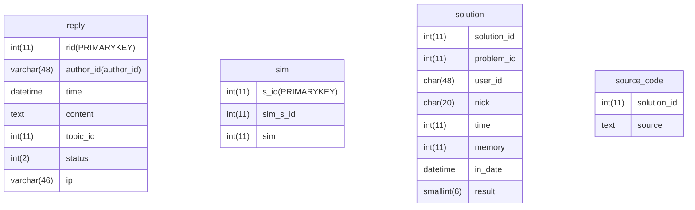
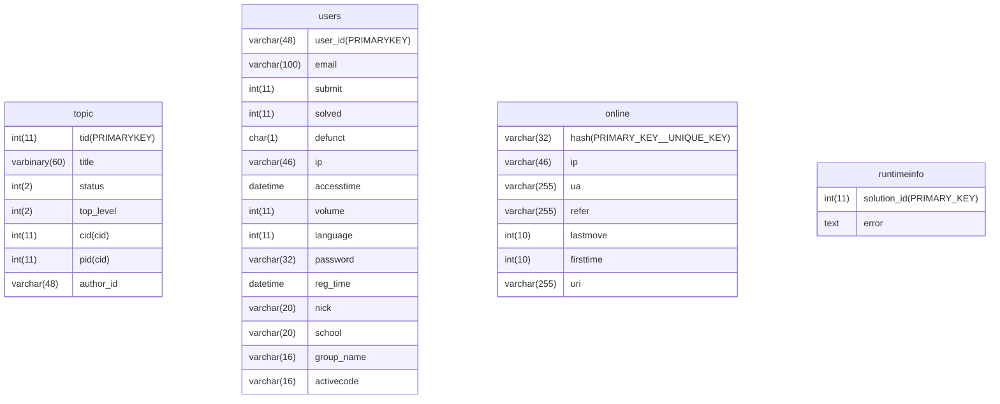
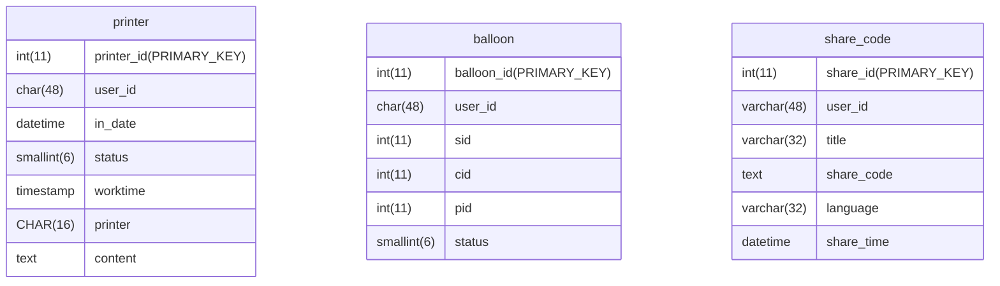

```mysql
set names utf8mb4; -- 占据更多的存储空间，但是显示特殊符号
int(11) -- 显示宽度为11，不影响int空间
varchar(48) -- 变长存储，更节省空间，但速度慢
mediumtext -- 可以存储2^24-1个字符
tinyint(4) -- 大小 1 byte
smallint(6) -- [-2^15,2^15–1]2个byte
varbinary(60) -- 变长，最多60个字节
defunct -- 僵尸进程
DECIMAL(10,3) -- 总位数最多10位，小数点3位
collate utf8mb4_unicode_ci -- 排序方式
datetme -- '1000-01-01 00:00:00.000000' to '9999-12-31 23:59:59.999999'
timestamp -- '1970-01-01 00:00:01.000000' to '2038-01-19 03:14:07.999999'
```










